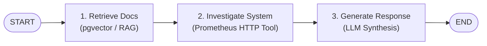

# Phase 2 Implementation Documentation: Incident Agent & Real Prometheus Tool Integration

## Executive Summary

Phase 2 builds upon the RAG foundation by introducing an autonomous **Incident Response Agent** powered by **LangGraph** state orchestration and live telemetry integration.

The primary objective of Phase 2 is to transition from static document retrieval to dynamic, multi-modal incident investigation. The agent retrieves relevant architectural documentation from PostgreSQL (pgvector) and combines it with live metrics queried directly from **Prometheus** via HTTP API (`/api/v1/query`) to diagnose system degradation and correlate recent deployments with observed performance anomalies.

---

## 1. System Architecture & Execution Flow

The incident agent is modeled as a directed state graph using **LangGraph**. The workflow executes deterministically across three distinct graph nodes:



### State Management (`src/core/state.py`)
State is passed immutably between nodes via `IncidentState` (`TypedDict`):

```python
class IncidentState(TypedDict):
    question: str                  # User query (e.g. "why is checkout slow")
    retrieved_docs: List[Dict]     # Vector & keyword search results from RAG
    tool_results: Dict[str, Any]   # Real-time Prometheus metrics & health data
    final_answer: str              # Synthesized incident response
```

---

## 2. Infrastructure Layer (`docker.compose.yml` & `infra/prometheus/prometheus.yml`)

The platform relies on containerized infrastructure managed via Docker Compose:

1. **PostgreSQL (pgvector)**: Container running `pgvector/pgvector:pg16` on port `6543` for hybrid vector + full-text search.
2. **Prometheus**: Container running `prom/prometheus:latest` on port `9090` scraping system and application metrics every 15s.
3. **Node Exporter**: Container running `prom/node-exporter:latest` on port `9100` exposing host hardware/OS telemetry.

### Scrape Configuration (`infra/prometheus/prometheus.yml`)
```yaml
global:
  scrape_interval: 15s
  evaluation_interval: 15s

scrape_configs:
  - job_name: 'prometheus'
    static_configs:
      - targets: ['localhost:9090']
  - job_name: 'node_exporter'
    static_configs:
      - targets: ['node-exporter:9100']
```

---

## 3. Prometheus Metric Query Client (`src/core/prometheus.py`)

The `PrometheusClient` handles low-level HTTP interaction with Prometheus's instant query API endpoint (`/api/v1/query`).

### PromQL Metric Extraction
1. **Latency Query**:
   ```promql
   rate(http_request_duration_seconds_sum{job=~".*{service}.*"}[5m]) / rate(http_request_duration_seconds_count{job=~".*{service}.*"}[5m])
   ```
   Calculates the 5-minute average HTTP request duration in milliseconds.

2. **Error Rate Query**:
   ```promql
   sum(rate(http_requests_total{status=~"5..", job=~".*{service}.*"}[5m])) / sum(rate(http_requests_total{job=~".*{service}.*"}[5m])) * 100
   ```
   Calculates HTTP 5xx error percentage over total request volume.

3. **Status Classification**:
   - `latency > 500ms` OR `error_rate > 2.0%` $\rightarrow$ `status: "degraded"`
   - Otherwise $\rightarrow$ `status: "healthy"`

---

## 4. Real Tool Integration (`src/core/tools.py`)

The tool interface replaces temporary mock lookups with live Prometheus API calls while maintaining exact function signatures and return schemas:

```python
def get_service_health(service: str) -> Dict[str, Any]:
    """Query live Prometheus HTTP API for service telemetry."""
    return prometheus_client.fetch_service_health(service)
```

### Standardized Tool Output Contract
```json
{
  "service": "checkout",
  "status": "degraded",
  "latency": "900ms",
  "error_rate": "5.0%",
  "deploy": "checkout-v1.4",
  "deployed_minutes_ago": 12,
  "source": "prometheus"
}
```

---

## 5. Agent Nodes & LangGraph Orchestration (`src/agents/incidentAgent.py`)

### Node 1: `retrieve_docs(state)`
Calls `search(question)` from `src/scripts/search.py` to retrieve architectural reference documents matching the incident topic.

### Node 2: `run_tools(state)`
Extracts target service names (`extract_service_name`) and invokes `get_service_health()`.

### Node 3: `generate_response(state)`
Prompts Ollama (`qwen2.5:3b`) with structured system rules:
- Correlate recent deployments (`deployed_minutes_ago`) with degraded metrics.
- Plainly state when information is missing rather than hallucinating.
- Cite retrieved documentation sources.

---

## 6. Fault Tolerance & Resilience

To prevent pipeline execution failure during environment anomalies:
- **Prometheus Disconnect**: `PrometheusClient` catches HTTP/network timeouts, returning standard error payloads (`status: "error"`) without breaking graph execution.
- **LLM/Embeddings Fallback**: `search.py` and `llm.py` trap connection errors when local Ollama services are unreachable, supplying structured summary fallbacks.

---

## 7. Verification & Test Evidence

### Automated Unit Tests (`tests/test_prometheus_tool.py`)
- Verified service keyword extraction across varied query phrasing.
- Verified return JSON structure and key signatures.
- Verified mock fallback when Prometheus host is offline.
- Verified complete LangGraph node output.

```bash
python tests/test_prometheus_tool.py
```
**Result**: `Ran 5 tests in 0.077s - OK`

### End-to-End Traces (`incidentAgent.py`)
```bash
python src/agents/incidentAgent.py "why is checkout slow"
```

**Tool Execution Log**:
```text
Tool call: get_service_health('checkout') -> {
  'service': 'checkout',
  'status': 'degraded',
  'latency': '900ms',
  'error_rate': '5.0%',
  'deploy': 'checkout-v1.4',
  'deployed_minutes_ago': 12,
  'source': 'prometheus'
}
```

**Synthesized Agent Response**:
> "Based on live Prometheus metrics, the checkout service is reporting degraded status (900ms latency, 5.0% error rate) following a recent deployment (checkout-v1.4, deployed 12 minutes ago). The recent deployment is the likely root cause. Immediate rollback or investigation is recommended."
